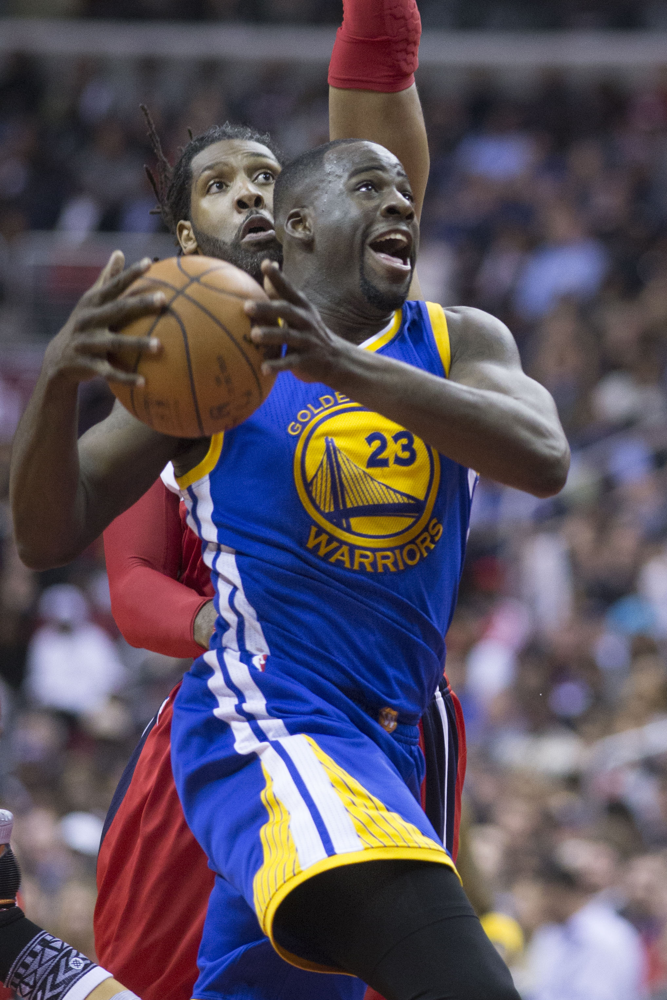
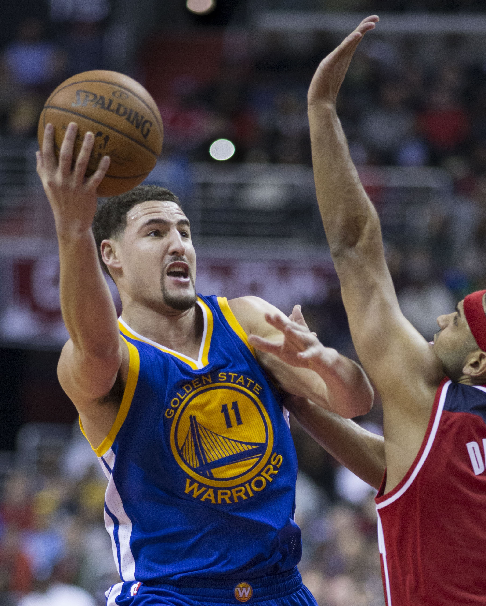
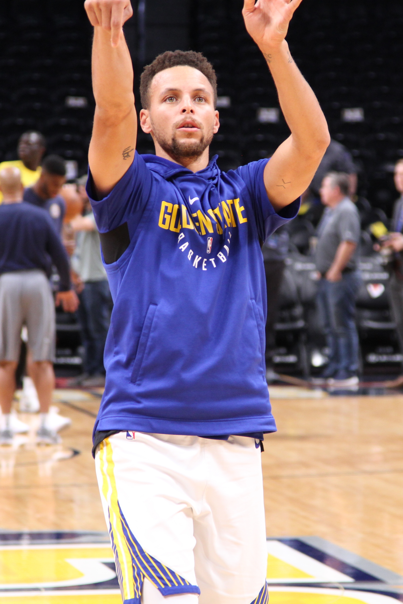
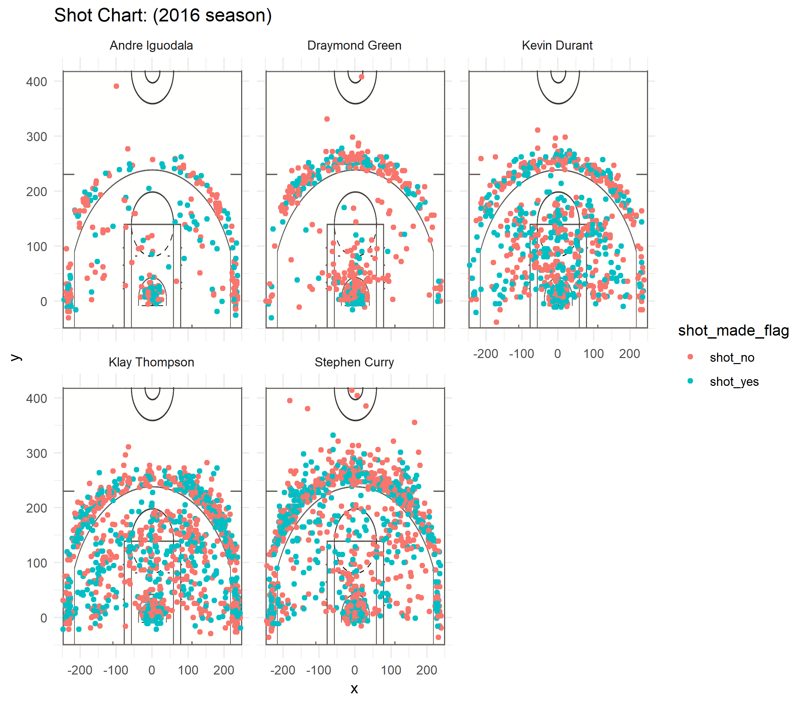

workout01-Carolus-Chan
================
Carolus Chan

It is the ultimate win condition in basketball to be the team that makes the most baskets in a given game. It is no wonder that basketball players are evaluated heavily on the shots make whether it be 2pt, 3pt, of free throw shots. The Golden States Warriors (GSW) is arguably the best team as of the last few years. Here, we take a look at some stats of shots made of the 5 players from the GSW in the 2016 season.

Before we jump into any of the numbers. Let's do a brief introduction of the players.

Andre Iguodala
==============

35 years old
Shooting guard / Small forward
Joined the GSW in 2013

Draymond Green
==============

29 years old
Power forward
Joined the GSW in 2012

Kevin Durant
============

30 years old
Small forward
Joined the GSW in 2016

Klay Thompson
=============

29 years old
Shooting guard
Joined the GSW in 2011

Stephen Curry
=============

31 years old Point guard Joined GSW in 2009 

Now on to the stats. Below are three tables for shots made and shots taken for the season of 2016

    ## # A tibble: 5 x 4
    ##   name           total  made perc_made
    ##   <fct>          <int> <int>     <dbl>
    ## 1 Andre Iguodala   210   134      63.8
    ## 2 Draymond Green   346   171      49.4
    ## 3 Kevin Durant     643   390      60.7
    ## 4 Klay Thompson    640   329      51.4
    ## 5 Stephen Curry    563   304      54.0

    ## # A tibble: 5 x 4
    ##   name           total  made perc_made
    ##   <fct>          <int> <int>     <dbl>
    ## 1 Andre Iguodala   161    58      36.0
    ## 2 Draymond Green   232    74      31.9
    ## 3 Kevin Durant     272   105      38.6
    ## 4 Klay Thompson    580   246      42.4
    ## 5 Stephen Curry    687   280      40.8

    ## # A tibble: 5 x 4
    ##   name           total  made perc_made
    ##   <fct>          <int> <int>     <dbl>
    ## 1 Andre Iguodala   371   192      51.8
    ## 2 Draymond Green   578   245      42.4
    ## 3 Kevin Durant     915   495      54.1
    ## 4 Klay Thompson   1220   575      47.1
    ## 5 Stephen Curry   1250   584      46.7

We can see from the total (3rd chart) the success rate of making shots is relative even across players. As expected the 2pt shots have a higher success rate than 3pts about 10% higher.

